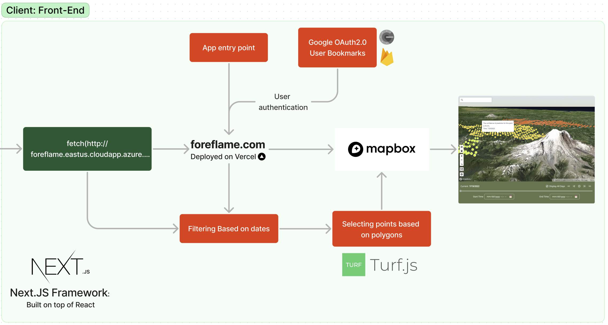

# ForeFlame: Wildfire Prediction Dashboard

> ForeFlame is a dashboard designed for Fire Analysts to view the probabilities of wildfire occurrences, along with other relevant parameters like vegetation, terrain, temperature, wind speed, and soil moisture, to make informed tactical decisions on wildfire management and mitigation.

---

## About the Team

We are a team of University of Washington graduate students (Global Innovation Exchange) driven to understand the behavior of Wildfires. This project is being sponsored by **Microsoft** and supported by Department of Natural Resources.

Our Vision is to Provide a fire management tool to predict the probability of wildfire occurrence and provide a comprehensive data source for fire analysts to make informed tactical decisions.

Given the complexity of gathering and analyzing data for accreditation and the growing sophistication of technology systems available to fire departments, ForeFlame believes a standard visualization for fire analysts is an important next step in mitigating Wildfires.

### My Role:

- Back-end development: Configuring and maintaining Azure Virtual Machines and disks, facilitating Machine Learning environments, postprocessing outputs from ML, creating back-end API endpoints through Flask application, and configuring and maintaining NGINX in Ubuntu for back-end APIs.
- Front-end development: Developing front-end through [NextJS](https://nextjs.org/), displaying GeoJSON data through Mapbox library. [Source.](https://github.com/tejabalu/Foreflame-Front-End)

---

## Architecture

ForeFlame uses various data aggregation techniques and machine learning methods to provide the possibility of occurrence of wildfires. There are three main components in its architecture:

### Data Sources and Machine Learning

The following are the different data sets currently being used to train and infer from the machine learning model.

- Weather data from [NOAA](https://www.ncdc.noaa.gov/cdo-web/datasets).
- NDVI (Normalized difference vegetation index) from [MODIS](https://modis.gsfc.nasa.gov/)
- Wildfire fuel data from [LANDFIRE](https://landfire.gov/%3C/ListItem%3E).

From the datasets above, a DNN model is used to predict the probability of occurrence of wildfires, with another KNN model trained with NDVI datasets which acts as a mask to the existing predictions.
The machine learning model itself is run in Azure VM using FarmVibes workflows.

### Postprocessing and back-end APIs

The machine learning outputs are converted to GeoJSON, and hosted through a Flask application, exposed through NGINX server (Azure VM).

### Visualization

The data is displayed through the Webapp built using NextJS and mapping tools from [MapBox](https://visgl.github.io/react-map-gl/) and [Turf.js](https://turfjs.org/).

---

## Features

The following are the functionalities currently implemented in ForeFlame.

### Secure OAuth 2.0

Secure authentication using Google Firebase for storing user preferences and bookmark polygons.

### Popup for each data points

View individual parameters of each pixels by clicking on each data point.

### Create bookmarks

Create bookmarks using polygons, which are linked to individual accounts and can be accessed anywhere.

### Navigate using bookmarks

Use bookmarks to keep tabs and navigate to places.

### Tooltips

View the function and usage of each component through helpful tooltips.

---

Compared to the existing solutions, ForeFlame aims to integrate more comprehensive datasets to provide the high-accuracy predictions of fire occurrence probability. Designed by incorporating real-time feedback from fire-analysts from DNR, and with ML models run using [FarmVibes](https://github.com/microsoft/farmvibes-ai), it also provides an intuitive interface with high responsiveness.
