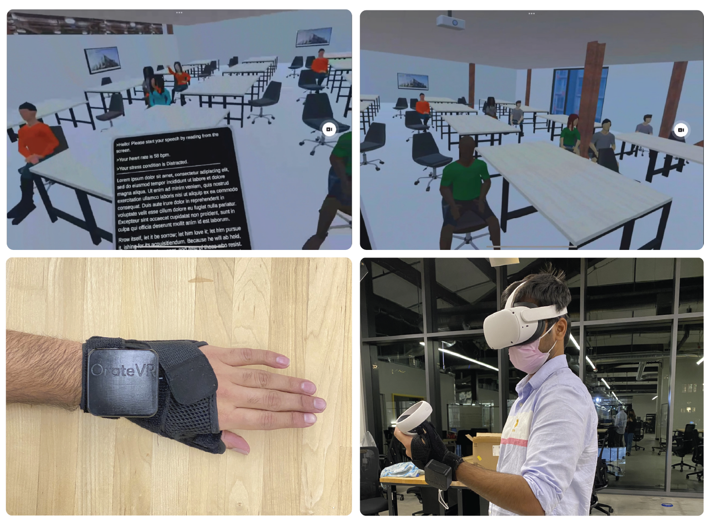
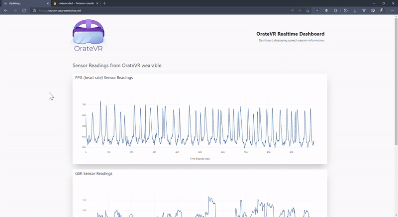

# OrateVR

> **Problem Statement:** How can we improve the experience of practicing public speaking using immersive technology and wearables?

**Stage fright** (or performance anxiety) is the **fear/anxiety/persistent phobia** that arises in an individual by the requirement to **perform in front of an audience.**

It can be **alleviated by constant practice and repetition,** but people lack the motivation and means to practice. There is a dire need for a mechanism for people to be able to practice and get feedback on themselves to improve.

Using **immersive tech like VR** simulates the biggest component that causes stage fright: **users being in the social environment**. Along with having accurate VR scenes and avatars, our solution involves the usage of sensors that tracks users' anxiety levels, enabling them to diagnose and improve themselves.

> **Solution:** By simulating real world conditions of public speaking through virtual reality, and tracking stress conditions of the users during their speech sessions, OrateVR provides at effective platform for one to practice their public speaking along with valuable insights and feedback regarding their performance.

Device that houses the sensors, circuit board, and the battery

---

## Intended Users:

Primary Target users:

- People suffering from glossophobia
- Speech disorders
- People suffering from social anxiety disorder
- People with fluency disorders(stuttering/stammering)

Secondary Target users:

- People learning a new language
- People with less public speaking experience
- Professions that involve more interaction (Sales, Teaching, Managers)

---

## Hardware Architecture:

The hardware architecture for OrateVr includes a PPG sensor and a GSR sensor connected to an Arduino Nano 33 IoT.

Hardware diagram of sensor and circuit board configuration

### Initial Prototype:

Initial prototype based on Raspberry Pi, Arduino Uno, and local Python scripts

### Final Prototype:

Custom circuit boards are designed in Fusion 360 and manufactured using the OtherMill.

PCB Prototyping

Completed PCB that houses Arduino Nano and connects to PPG, GSR, and the battery

Final model with Nano casting data to cloud through WiFi

---

## Software Architecture:

Software architecture showing database connecting to, Python scripts running on Azure, Front-end dashboard, and VR headsets

The data from the firebase is processed using python scripts running on Azure servers. The following are the functions of the python script:

- Removes the noise from the data using bandpass and moving average filters
- Uses machine learning models to predict the moods of the user
- Posts the processed data and the user mood data back in Firebase

The **C#** scripts running on Unity pull the information from the Firebase database and show it to the user in the VR application.

The Dashboard (based on **React**, **Plotly Dash**, and **Tailwind CSS**) displays the real-time sensor data and the user’s mood on the dashboard.

### Data Refinement:

Raw signal (Red) and the Filtered signal after noise removal (blue)

The raw PPG data (red) is filtered using bandpass filters that remove unnecessary frequencies (bandpass filters remove both high and low frequencies based on the specified thresholds).

The filter based on amplitude values removes the ranges above and below certain thresholds (PPG values that are not heartbeats).

The final heartbeats detected corresponding to the PPG signals

The heart rates are detected using the HeartPy library based on SciPy modules.

### ML for Mood Prediction:

A dense neural network was used to classify the user’s mood into three buckets (stressed, distracted, and normal). This section goes into the details about how the machine learning model was arrived at.

The datasets were taken from Kaggle ([SWELL dataset | Kaggle](https://www.kaggle.com/datasets/qiriro/swell-heart-rate-variability-hrv)) that studied subjects of 25 members doing typical office work, while taking measurements using various instruments like the EEG sensor, body postures, skin conductance (correlating to GSR), etc.

> To get the relevant parameters from the datasets, a Pearson’s correlation was run to find out inputs that influence the outputs. Based on these results, the corresponding parameters were derived from the PPG sensor in the previous step.

Pearson’s correlation to measure input parameter confluence with outputs

After the datasets are obtained, and the relevant data from the sensors are arranged, the machine learning model had to be constructed and trained.

Through a process of trial and error, it was concluded that a combination of 18 nodes in the 1st layer, and 10 nodes in the 2nd layer gave the maximum accuracy.

Dense neural network with hidden nodes connecting the input and output layers

Accuracy of the machine learning model

The classifications from the machine learning model were sent back to Firebase to be displayed on the dashboard and to the user in VR.

---

## OrateVR in working:

The following are some of the images of the final product:

### Oculus Application:

The following is the interface that the user sees in the Oculus. The location is in a classroom with other students, a commonplace a typical user would prefer to practice speech in.

The tablet on the screen moves with the controller of the Oculus.

Oculus App with an internal interface that shows real-time data of the user, and text to practice speech with

### Web Application:

The web application shows the real-time speech session of the user on the dashboard. One can see the sensor values and the mood of the user based on these sensor values.

Dashboard showing real-time sensor values and user mood during a speech session

---

## Conclusion:

The application of emerging technology and Virtual Reality in the space of speech development has been explored. Upon reflecting on this journey, we realized we could have enhanced the user experience by including speech and fluency analysis as part of the feedback, which we look forward to in the upcoming projects.
