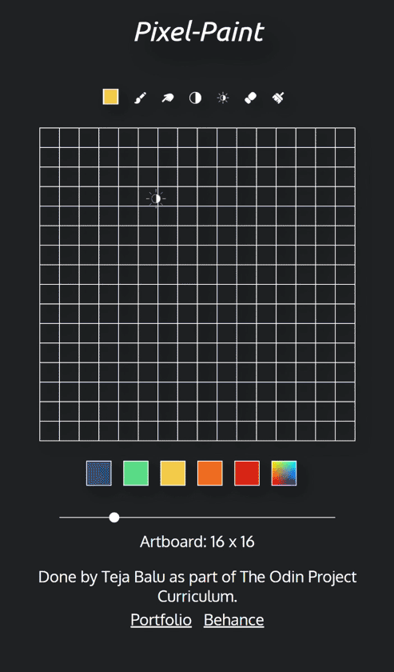
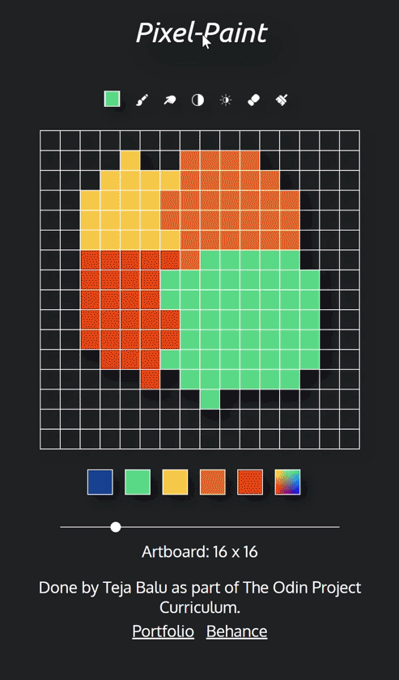

# Pixel-Paint

Please visit the following link to look at the implemented version of the project:

> [Pixel-Paint (tejabalu.github.io)](https://tejabalu.github.io/The_Odin_Project/Pixel-Paint/index.html)

The above is a fun personal project done by me in the process of learning JavaScript. It is a painting web application where the users have options to set the art board size, paint, smudge, erase and lighten the pixels. It is responsive to different screen sizes.

The mouse cursor changes based on the tool selected by the user for a better feedback.

Each pixel is a div box, and the brush tool changes the background color when clicked in the region. Erase, lighten, and darken functions modify the background color by removing the background color property, increase and decrease the RGB values respectively.

The blend/smudge function helps to create gradients between two different colors. Its implemented by taking an average of previous set number of pixel colors. The strength of the blend is determined by the number of pixel values we are taking into consideration.

Thanks for reading!
